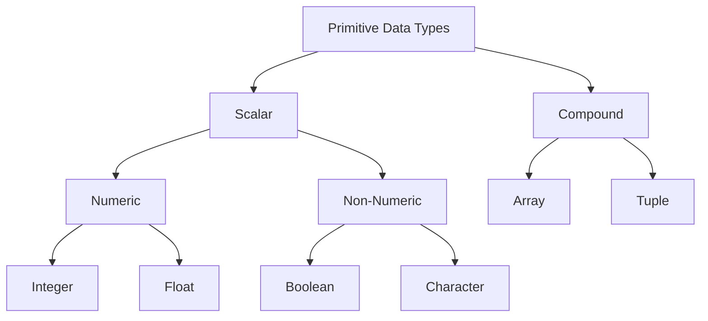

# Rust Programming Basics

A comprehensive guide to fundamental Rust programming concepts with examples and best practices. Ideal for beginners and those transitioning from other languages.

## Table of Contents

- [Program Structure](#program-structure)
- [Basic Syntax](#basic-syntax)
- [Variables and Mutability](#variables-and-mutability)
- [Data Types](#data-types)
- [Formatting and Macros](#formatting-and-macros)
- [Comments](#comments)
- [Scope and Shadowing](#scope-and-shadowing)
- [Best Practices](#best-practices)

## Program Structure

### Main Function

The entry point of every Rust program:
```rust
fn main() {    
	// Execution starts here
}
```

## Basic Syntax Rules

- Code blocks are enclosed in curly braces `{}`
- Statements end with semicolons `;`
- Functions are defined using the `fn` keyword
- Variables are declared using the `let` keyword

## What is a macro?

A macro is an expression that has a `!` before the parenthesis (). i.e.
macro_name!()

## What are macros used for?

Macros are used to generate code at compile time. They are used to create functions, structs, enums, and other code constructs.

## The Basic Formatting Rules

- Rust code blocks are enclosed in curly braces `{}`.
- Statements are terminated by a semicolon `;`.
- Expressions do not end with a semicolon.
- Functions are defined using the `fn` keyword.
- Variables are declared using the `let` keyword.
- Comments are enclosed in `//`.

## Single Placeholder

The single placeholder is used to format a single value in a string.

```rust
let name = "Rustacean";
println!("Hello, {}!", name);
```

## Multiple Placeholders

The multiple placeholders are used to format multiple values in a string.

```rust
let name = "Rustacean";
let age = 25;
println!("Hello, {}! You are {} years old.", name, age); // Hello, Rustacean! You are 25 years old.
```

## Positional Arguments

The positional arguments specify the position of the value in the string.

The first value is assigned 0, the second value is assigned 1, and so on.

```rust
let name = "Rustacean";
let age = 25;
println!("{1} is {0} years old.", age, name); // Rustacean is 25 years old.
```

## Named Arguments

The named arguments specify the name of the value in the string.

```rust
let name = "Rustacean";
let age = 25;println!("{name} is {age} years old."); // Rustacean is 25 years old.
```

## Placeholder Traits

If we want to convert the value to binary, hexadecimal, or octal write:

`{:b}` for binary
`{:x}` for hexadecimal
`{:o}` for octal

```rust
let num = 10;
println!("Binary: {:b}, Hexadecimal: {:x}, Octal: {:o}", num, num, num); // Binary: 1010, Hexadecimal: a, Octal: 12
```

## Debug Trait

It is possible to print multiple values using a single placeholder with the debug trait.

```rust
let name = "Rustacean";
let age = 25;
println!("{:?}", (name, age)); // ("Rustacean", 25)
```

# Printing Styles

The table below shows the different macros used to print in Rust.

| Macro | Description |
| --- | --- |
| `println!` | Prints a string to the console. |
| `print!` | Prints a string to the console without a newline. |
| `eprintln!` | Prints an error message to the console with a newline. |
| `eprint!` | Prints an error message to the console without a newline. |

# Comments

Comments are used to add notes to the code. They are not compiled and are ignored by the compiler.

## Line Comments

Line comments are used to add comments to a single line of code.

```rust
let x = 5; // This is a line comment.
```

## Block Comments

Block comments are used to add comments to multiple lines of code.

```rust
/* This is a block comment.This is a block comment.This is a block comment.*/
```

## Doc Comments

Doc comments are used to add documentation to the code. They are used to describe the code and are used by the compiler to generate documentation.

```rust
/// This is a doc comment.
```

# Variables

Variables are used to store values. By default, variables are immutable.

## Binding

Rust uses the `let` keyword to bind a value to a variable.

## Naming Conventions

- Variable names must start with a lowercase letter.
- Variable names can contain letters, numbers, and underscores.
- Variable names are case-sensitive.

## Initialize a Variable

The example below declares a variable named `language` and binds it to the value `"Rust"`.

```rust
fn main() {    
	let language = "Rust";    
	println!("{}", language); // Rust
}
```

## Make a Variable Mutable

To make a variable mutable, we use the `mut` keyword.

```rust
fn main() {    
	let mut language = "Rust";    
	language = "Python";    
	println!("{}", language); // Python
}
```

## Assigning Multiple Variables

It is possible to assign multiple variables in a single statement.

```rust
let (x, y) = (1, 2);
println!("x: {}, y: {}", x, y); // x: 1, y: 2
```

## Scope and Shadowing

Scope is the region of the code where a variable is valid. Shadowing is a feature that allows a variable to be reassigned a new value.

### Scope

The scope of a variable refers to the region of the code where a program can access the variable.

There are two types of variables:

- Local variables:

A variable that is within a block of code, `{}` that cannot be accessed outside of the block is a local variable.
After the closing brace `}` of the block, the variable is freed and memory for the variable is deallocated.

- Global variables:

A variable that is declared outside of a block of code is a global variable.
Global variables are valid for the entire program and are not freed until the program terminates.

```rust
fn main() {    
	let outer_var = "Outer Variable";    
	{        
		let inner_var = "Inner Variable";        
		println!("{}", inner_var);        
		println!("{}", outer_var);    
	}    
	println!("{}", inner_var); // use of inner_var outside of the block
}
```

```
error[E0425]: cannot find value `inner_var` in this scope
 --> main.rs:8:36
  |
8 |     println!("inner variable: {}", inner_var); // use of inner_var outside scope
  |                                    ^^^^^^^^^^^^^^ help: a local variable with a similar name exists: `outer_variable`

error: aborting due to previous error

For more information about this error, try `rustc --explain E0425`.
```

### Shadowing

Shadowing is a technique that allows a variable declared within a certain scope has the same name as a variable declared in an outer scope. This is also known as masking.

```rust
fn main() {    
	let outer = 12;    
	{        
		let inner = 13;        
		let outer = 14;        
		println!("{}", outer); // 14    
	}    
	println!("{}", outer); // 12
}
```

## Data Types

Rust is a statically typed language, which means that the type of a variable is known at compile time.

We can define a variable in two ways in Rust:

### Implicit Type

The compiler infers the type of the variable based on the value assigned to it.

```rust
let x = 5; // x is of type i32
```

### Explicit Type

The programmer specifies the type of the variable.

```rust
let x: i32 = 5; // x is of type i32
```

## Primitive Data Types

The following tree shows the different primitive data types in Rust.



### Scalar Type 

They store a single value.

Below is the list of scalar types:

#### 1. Integer Types

- Signed: `i8`, `i16`, `i32`, `i64`, `i128`
- Unsigned: `u8`, `u16`, `u32`, `u64`, `u128`
- Default: `i32`
- Size depends on the number of bits

#### 2. Floating-Point Types

- `f32`: Single precision
- `f64`: Double precision (default)
- Example: `let float_num: f64 = 3.14159;`

#### 3. Boolean Type

- Values: `true` or `false`
- Size: One byte
- Example: `let is_active: bool = true;`

#### 4. Character Type

- Unicode scalar value
- Size: Four bytes
- Example: `let letter: char = 'A';`

### Compound Types

Types that group multiple values:

#### 1. Array

- Fixed-length collection of same-type elements
- Type notation: `[T; N]` where T is type and N is length
- Zero-based indexing

#### 2. Tuple

- Fixed-length collection of different-type elements
- Type notation: `(T1, T2, ...)` where T1, T2 are types
